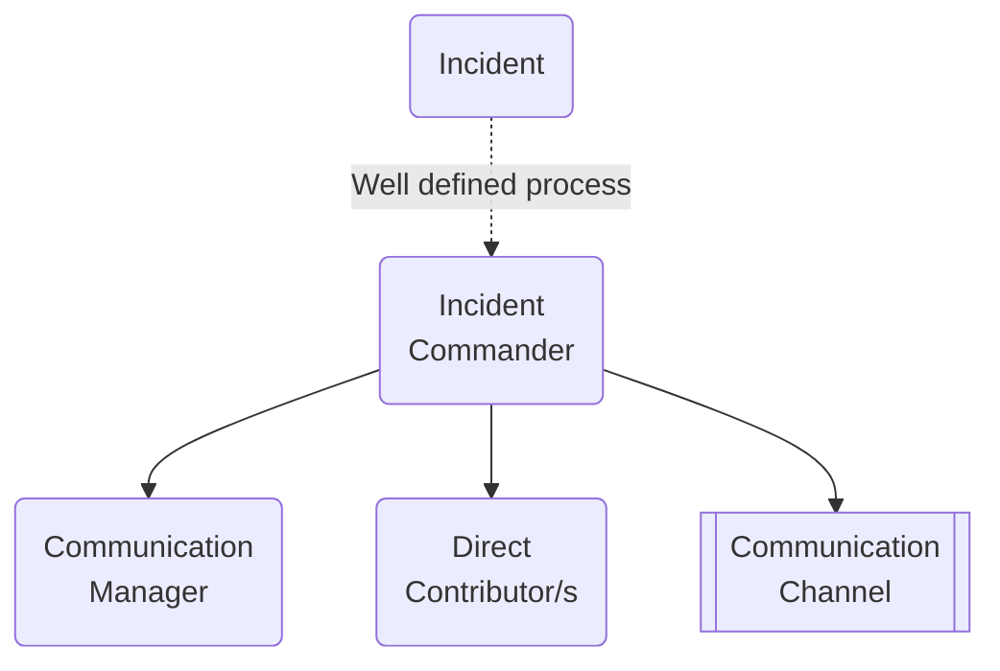

# Summary

SRE as an enabling team (contrary to the Google approach). Long live DevOps as culture and approach!

Ops and Oncall:

1. Design document
2. Production Readiness and Pre-mortems
3. Runbooks
4. OnCall
5. Post-mortems
6. Continuous improvements

## Production Readiness && Pre-mortems

Checklist for checking that new code is production ready:

1. Do we have enough observability for the onCall and operating the component?
2. 2-3 scenarios for things that may go wrong ([pre-mortem](https://en.wikipedia.org/wiki/Pre-mortem))
3. ...

## Runbooks

TBA

Best practices:

- Do hands-on exercises, dry runs, etc.

Types:

- manual
- semi-manual
- automatic

Tools:

- Ansible, custom Kubernetes operator, manual (with copy&paste commands) instructions
- https://backstage.io/ 
- https://www.rundeck.com/open-source

## Oncall

Small / medium company:

1. Level1
2. Level2
3. Whole team

Tools:

- [Opsgenie](https://www.atlassian.com/software/opsgenie)
- [Pagerduty](https://www.pagerduty.com/)

TODO: training, ...

see [Practice of Cloud System Administration vol2](https://www.amazon.com/Practice-Cloud-System-Administration-Practices/dp/032194318X).

## Incident Management

Incident management skills and practices exist to channel the energies of enthusiastic individuals.

Roles:

- Incident Commander (IC) - "the commander holds all positions that they have not delegated. If appropriate, they can remove roadblocks that prevent Ops from working most effectively" ([sre book](https://www.atlassian.com/incident-management/incident-response/incident-commander#3-duties-of-an-incident-commander)). IC has super powers.

- Communication Manager (CM) -  manages communications, periodically updates about the incident to the other teams, stakeholders, and clients (directly or indirectly). The communication could be done by email, slack, or a [statuspage](https://spacelift.statuspage.io).

- Direct Contributor (DC) - a person or persons that works on solving the problem

Procedure:

1. Alert -> OnCaller or person on duty become a IC
2. IC creates a channel to coordinate the incident (a call, slack channel, etc.)
3. IC names CM and DCs
4. CM handles the external communication and stakeholder management
5. DCs works on the solution, ICs use his super powers to ensure we can resolve the incident.

After:

1. IC schedule a postmortem meeting and find a facilitator
2. (optional) DCs with ICs check which clients were affected
3. CM with IC publish a result of postmortem to clients if needed

Best Practices:

- Prioritise: Stop the bleeding, restore service, and preserve the evidence for root-causing,
- Clear communication and hand-offs,
- see: [sre books on managing incidents](https://sre.google/sre-book/managing-incidents/).

## Postmortem

Best practices:

1. Have a template document for all your Postmortem
2. Pick a facilitator, possibly person who was not involved
3. Do the postmortem in up to 1 weeks (max 1.5).
4. Do blameless postmortem,
5. Assign responsible persons for each of the action items.

see: https://www.atlassian.com/incident-management/postmortem/blameless

## SLA & Uptime

- https://uptime.is/

## Related topics

- Business Continuity Plan
- Disaster recovery (RTO and RPO)

## References

- https://sre.google/sre-book/managing-incidents/
- https://www.atlassian.com/incident-management/incident-response/incident-commander#3-duties-of-an-incident-commander
- https://wa.aws.amazon.com/wellarchitected/2020-07-02T19-33-23/wat.concept.runbook.en.html
