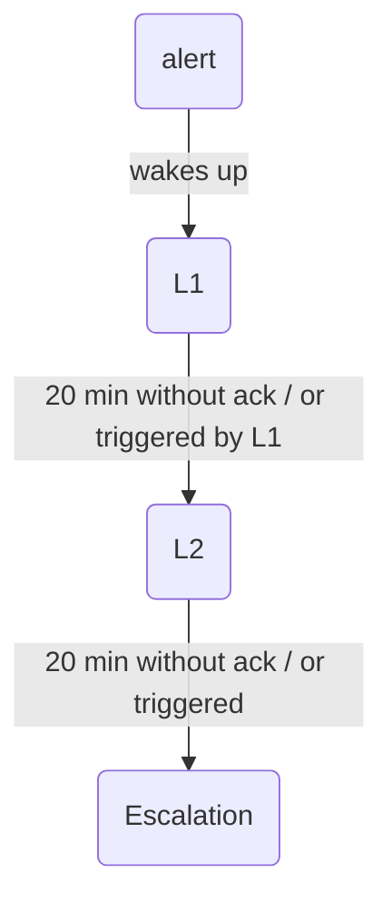
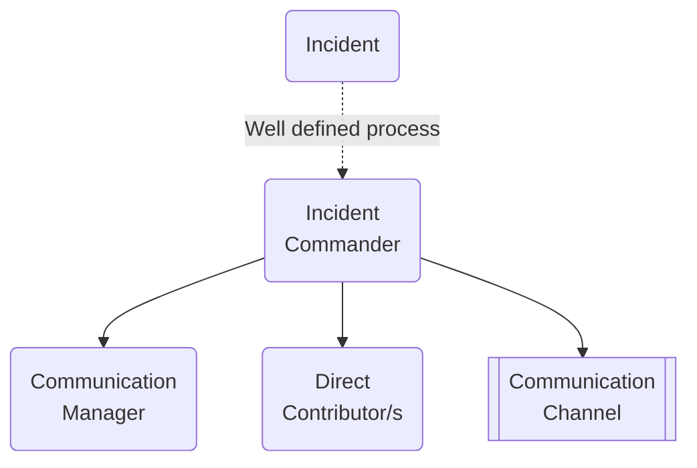

# Summary

SRE as an enabling team (contrary to the Google approach). Long live DevOps as culture and approach!

Running software in production:

1. Design document should include aspects of reliability,
2. Production Readiness and Pre-mortems
3. Runbooks
4. Post-mortems
4. SLA/SLO/SLI/uptime
5. Error budget
6. OnCall Duty
7. Classification of incident/issue/bug
8. Incident Management

Continuous (even smallest) improvements.

## Design document

Not necessary for every feature, its main purpose is to get feedback from other engineers on how a given functionality is going to be built.  

## Production Readiness && Pre-mortems

Production Readiness - checklist for checking that new code is production ready:

1. Do we have enough observability for the onCall and operating the component?
   - monitoring dashboards,
   - alerts,
   - logging,
   - training.

2. [pre-mortem](https://en.wikipedia.org/wiki/Pre-mortem) should be included as well - 2-3 scenarios for things that may go wrong,

3. New onCallers will use this document to understand how the component works in the production.

## Runbooks

Best practices:

- Do hands-on exercises, dry runs, etc.

Types:

- manual
- semi-manual
- automatic

Tools:

- Ansible, custom Kubernetes operator, manual (with copy&paste commands) instructions
- https://backstage.io/
- https://www.rundeck.com/open-source
- platforms for continuous deployment of IaC, e.g., [Spacelift](https://spacelift.io/)
- platforms for continuous deployment of software, e.g., gitlab
- docs/internal wiki, e.g., [archbee](https://www.archbee.io/) or [notion.so](https://www.notion.so)

## Postmortem

Best practices:

1. Have a template document for all your Postmortem
2. Pick a facilitator, possibly person who was not involved
3. Do the postmortem in up to 1 weeks (max 1.5).
4. Do blameless postmortem,
5. Assign responsible persons for each of the action items.

see: https://www.atlassian.com/incident-management/postmortem/blameless

## SLA & Uptime

### Uptime

When your service works and when it does not:

- https://uptime.is/

### SLA/SLO/SLI

---
| Abbr  | Name  | Description |
| ----- | ----- | ----------- |
| SLA   | Service Level Agreement | what we promise to customer, possibly a penalty if not met |
| SLO   | Service Level Objective | what we promise to ourselves, what we see as our objective, SLO >= SLA |
| SLI   | Service Level Indicator | What we measure to say our system is available |
---------

Example:

```text
99.95% of well-formed queries correctly processed under 500 ms
```

Remember:

**Measure at the system boundaries** and **focus on the customer/consumer experience**.

### Tools

- Prometheus/Grafana
- Datadog / Newrelic
- statuscake
- Opsgenie

### Additional Reading materials

- https://cloud.google.com/blog/products/devops-sre/availability-part-deux-cre-life-lessons
- [SRE fundamentals 2021: SLIs vs SLAs vs SLOs](https://cloud.google.com/blog/products/devops-sre/sre-fundamentals-sli-vs-slo-vs-sla)
- [how to define SLI and SLO by newrelic](https://newrelic.com/blog/best-practices/best-practices-for-setting-slos-and-slis-for-modern-complex-systems)
- https://www.atlassian.com/incident-management/kpis/sla-vs-slo-vs-sli

## Error budget

Goal: go fast but slow down when there is a tight corner.

- Shall we speed up? We did not have any incident, we can move faster.
- Shall we slow down? E.g., two incident, close to violate/or not delivering our SLA, we slow down.

We track SLA vs SLIs to tell us where we are.

## Oncall duty

Small / medium company:

1. Level1
2. Level2
3. Whole engineering team



Difference:

- time to ACK
- time to ACT
- time to inform customers, e.g., with the statuspage
- interval of updates on the progress

Important:

1. Training
2. Runbooks
3. Dry of hands-on drills
4. Resilience/failover/graceful degradation is a part of the feature design
5. Implement the action items from post-mortems

Tools:

- [Opsgenie](https://www.atlassian.com/software/opsgenie)
- [Pagerduty](https://www.pagerduty.com/)
-  Status.io or [statuspage](https://www.atlassian.com/software/statuspage), e.g.., https://spacelift.statuspage.io

see [Practice of Cloud System Administration vol2](https://www.amazon.com/Practice-Cloud-System-Administration-Practices/dp/032194318X).

## Classification of incident/issue/bug

 ---
| Impact  |  Description     |
| ------- | ----- |
| P1      |  business dow situation or high financial impact, client unable to operate                                               |
| P2      | A major component of the clients’ ability to operate is affected.<br /> Some aspects of the business can continue but its a major problem.  |
| P3      | issue is affecting efficient operation by one or more people. Core not affected |
| P4      | inconvenience or annoying, a walkaround exists |
 ---------

* P1 detected and needs to be addressed
* P2 if detected, addressing it might start during the business hours
* P3
* P4

Commitment to customers (common in contracts with enterprises):

1. How fast they are notified about the incident,
2. Time to stop bleeding / finding workaround
3. Time for fixing the issue
4. Response time to customer tickets

Hint.

Here helps to release certain functionality as apha or RC or behind feature flags to most friendly customers to be able to move faster.

## Incident Management

Incident management skills and practices exist to channel the energies of enthusiastic individuals.



Roles:

- Incident Commander (IC) - "the commander holds all positions that they have not delegated. If appropriate, they can remove roadblocks that prevent Ops from working most effectively" ([sre book](https://www.atlassian.com/incident-management/incident-response/incident-commander#3-duties-of-an-incident-commander)). IC has super powers.

- Communication Manager (CM) -  manages communications, periodically updates about the incident to the other teams, stakeholders, and clients (directly or indirectly). The communication could be done by email, slack, or a [statuspage](https://spacelift.statuspage.io).

- Direct Contributor (DC) - a person or persons that works on solving the problem

Procedure:

1. Alert -> OnCaller or person on duty become a IC
2. IC creates a channel to coordinate the incident (a call, slack channel, etc.)
3. IC names CM and DCs
4. CM handles the external communication and stakeholder management
5. DCs works on the solution, ICs use his super powers to ensure we can resolve the incident.

After:

1. IC schedule a postmortem meeting and find a facilitator
2. (optional) DCs with ICs check which clients were affected
3. CM with IC publish a result of postmortem to clients if needed

Best Practices:

- Prioritise: Stop the bleeding, restore service, and preserve the evidence for root-causing,
- Clear communication and hand-offs,
- see: [sre books on managing incidents](https://sre.google/sre-book/managing-incidents/).

## Related topics

- Business Continuity Plan
- Disaster recovery (see [RTO and RPO](https://www.beyond.pl/baza-wiedzy/poradniki/rto-rpo-disaster-recovery/)):

  - RTO - Recovery Time Objective
  - RPO - Recovery Point Objective

## References

- https://sre.google/sre-book/managing-incidents/
- https://www.atlassian.com/incident-management/incident-response/incident-commander#3-duties-of-an-incident-commander
- https://wa.aws.amazon.com/wellarchitected/2020-07-02T19-33-23/wat.concept.runbook.en.html
