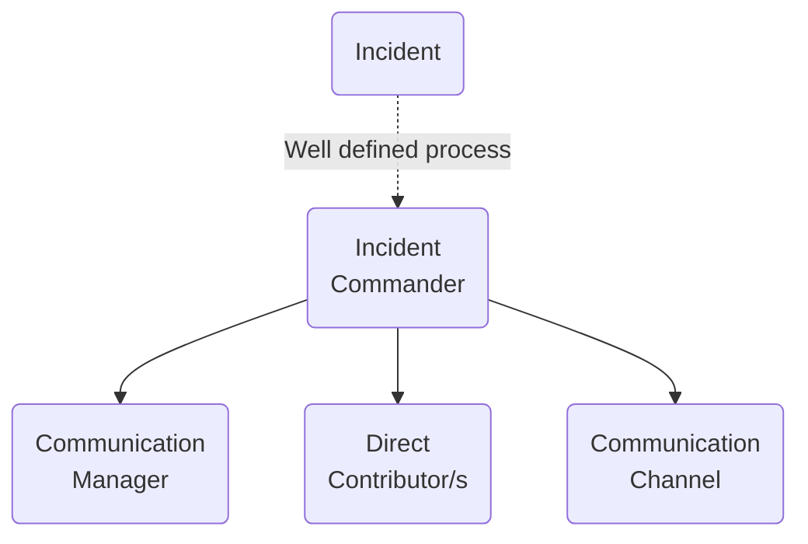

# Summary

## Oncall

## Runbook

## Incident Management

Roles:

- Incident Commander (IC) - "the commander holds all positions that they have not delegated. If appropriate, they can remove roadblocks that prevent Ops from working most effectively" ([sre book](https://www.atlassian.com/incident-management/incident-response/incident-commander#3-duties-of-an-incident-commander)).

- Communication Manager (CM) -  manages communications, periodically updates about the incident to the other teams, stakeholders, and clients (directly or indirectly). The communication could be done by email, slack, or a [statuspage](https://spacelift.statuspage.io).

- Direct Contributor (DC) - a person or persons that works on solving the problem

Procedure:

1. Alert -> OnCaller or person on duty become a IC
2. IC creates a channel to coordinate the incident (a call, slack channel, etc.)
3. IC names CM and DCs
4. CM handles the external communication and stakeholder management
5. DCs works on the solution, ICs use his super powers to ensure we can resolve the incident.

After:

1. IC schedule a postmortem meeting and find a facilitator
2. (optional) DCs with ICs check which clients were affected
3. CM with IC publish a result of postmortem to clients if needed

Best Practices:

- see: https://sre.google/sre-book/managing-incidents/
- Prioritize: Stop the bleeding, restore service, and preserve the evidence for root-causing.

## Postmortem

xyz

## References

- https://sre.google/sre-book/managing-incidents/
- https://www.atlassian.com/incident-management/incident-response/incident-commander#3-duties-of-an-incident-commander
